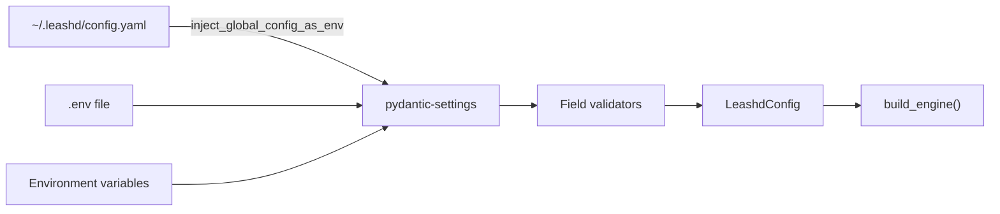

# Configuration Reference

Most configuration is managed via the `leashd` CLI (`leashd init`, `leashd browser`, `leashd effort`, etc.). This document covers the environment variable reference for advanced use cases and automation.

`LeashdConfig` (`core/config.py`) uses pydantic-settings to load configuration from environment variables prefixed with `LEASHD_`. Values can be set in `~/.leashd/config.yaml` (global), a `.env` file in the project root, or as environment variables.

## Loading Flow



Each layer overrides the one before it: `~/.leashd/config.yaml` → `.env` → environment variables (highest priority). `inject_global_config_as_env()` bridges the YAML config to `os.environ` so pydantic-settings picks it up. Validators run after loading to resolve paths, parse user IDs, and validate policy files.

## Required Variables

| Variable | Type | Description |
|---|---|---|
| `LEASHD_APPROVED_DIRECTORIES` | `list[Path]` | Directories the agent is allowed to operate in (comma-separated). All must exist. Expanded and resolved to absolute paths. First directory is the default working directory. |

## Full Reference

### Agent Settings

| Variable | Type | Default | Description |
|---|---|---|---|
| `LEASHD_MAX_TURNS` | `int` | `150` | Maximum agent turns per message (default for all modes) |
| `LEASHD_WEB_MAX_TURNS` | `int` | `300` | Maximum agent turns in `/web` mode. Falls back to `LEASHD_MAX_TURNS` if not set. |
| `LEASHD_TEST_MAX_TURNS` | `int` | `200` | Maximum agent turns in `/test` mode. Falls back to `LEASHD_MAX_TURNS` if not set. |
| `LEASHD_AGENT_TIMEOUT_SECONDS` | `int` | `3600` | Agent execution timeout in seconds (60 minutes) |
| `LEASHD_SYSTEM_PROMPT` | `str \| None` | `None` | Additional system prompt appended to the agent |
| `LEASHD_ALLOWED_TOOLS` | `list[str]` | `[]` | Whitelist of tools the agent can use (empty = all) |
| `LEASHD_DISALLOWED_TOOLS` | `list[str]` | `[]` | Blacklist of tools the agent cannot use |
| `LEASHD_MCP_SERVERS` | `dict` | `{}` | JSON dict of MCP server configurations |
| `LEASHD_EFFORT` | `Literal["low", "medium", "high", "max"] \| None` | `"medium"` | Thinking depth for the Claude agent |

### Safety Settings

| Variable | Type | Default | Description |
|---|---|---|---|
| `LEASHD_POLICY_FILES` | `list[Path]` | `[]` | Comma-separated paths to YAML policy files. Loaded in order; later files can override settings. |
| `LEASHD_APPROVAL_TIMEOUT_SECONDS` | `int` | `300` | Seconds to wait for human approval before defaulting to deny |
| `LEASHD_INTERACTION_TIMEOUT_SECONDS` | `int \| None` | `None` | Seconds to wait for user response to questions and plan reviews. `None` = wait indefinitely. |

### Authentication & Rate Limiting

| Variable | Type | Default | Description |
|---|---|---|---|
| `LEASHD_ALLOWED_USER_IDS` | `set[str]` | `set()` | Comma-separated user IDs allowed to interact. Empty set = allow all. |
| `LEASHD_RATE_LIMIT_RPM` | `int` | `0` | Requests per minute per user. `0` = no rate limiting. |
| `LEASHD_RATE_LIMIT_BURST` | `int` | `5` | Maximum burst size for rate limiter token bucket |

### Connector

| Variable | Type | Default | Description |
|---|---|---|---|
| `LEASHD_TELEGRAM_BOT_TOKEN` | `str \| None` | `None` | Telegram bot API token. If set, runs with Telegram connector. If unset, runs CLI REPL. |

### Storage

| Variable | Type | Default | Description |
|---|---|---|---|
| `LEASHD_STORAGE_BACKEND` | `str` | `"sqlite"` | Storage backend: `"sqlite"` (persistent, default) or `"memory"` |
| `LEASHD_STORAGE_PATH` | `Path` | `.leashd/messages.db` | Path to SQLite database file (only used when backend is `"sqlite"`) |

### Agent Mode

| Variable | Type | Default | Description |
|---|---|---|---|
| `LEASHD_DEFAULT_MODE` | `str` | `"default"` | Default session mode: `"default"` (balanced), `"plan"` (review before execute), or `"auto"` (implement directly) |

### Browser

| Variable | Type | Default | Description |
|---|---|---|---|
| `LEASHD_BROWSER_BACKEND` | `Literal["playwright", "agent-browser"]` | `"playwright"` | Browser automation backend. `playwright` uses Playwright MCP; `agent-browser` uses the agent-browser CLI skill. |
| `LEASHD_BROWSER_HEADLESS` | `bool` | `false` | Run Playwright browser in headless mode (no visible window). Useful for CI or remote sessions. Only applies to `playwright` backend. |
| `LEASHD_BROWSER_USER_DATA_DIR` | `str \| None` | `None` | Chrome user data directory for persistent `/web` sessions. When set, `/web` injects `--user-data-dir` into Playwright MCP args at runtime. `/test` always uses a temporary profile. |

### Streaming

| Variable | Type | Default | Description |
|---|---|---|---|
| `LEASHD_STREAMING_ENABLED` | `bool` | `True` | Enable real-time message streaming to connector |
| `LEASHD_STREAMING_THROTTLE_SECONDS` | `float` | `1.5` | Minimum interval between streaming updates |

### Task Orchestration

| Variable | Type | Default | Description |
|---|---|---|---|
| `LEASHD_TASK_ORCHESTRATOR` | `bool` | `false` | Enable the multi-phase task orchestrator. When enabled, `/task` commands drive spec→explore→validate→plan→implement→test→PR workflows. |
| `LEASHD_TASK_MAX_RETRIES` | `int` | `3` | Maximum test-failure retries per task before escalating to the user |
| `LEASHD_TASK_PHASE_TIMEOUT_SECONDS` | `int` | `1800` | Maximum seconds per phase (default 30 minutes). Phases that exceed this timeout are marked as failed. |

See [Autonomous Mode](autonomous-mode.md#task-orchestrator) for the full task orchestrator reference.

### Logging

| Variable | Type | Default | Description |
|---|---|---|---|
| `LEASHD_LOG_LEVEL` | `str` | `"INFO"` | Log level (DEBUG, INFO, WARNING, ERROR) |
| `LEASHD_AUDIT_LOG_PATH` | `Path` | `.leashd/audit.jsonl` | Path to the audit JSONL log file |
| `LEASHD_LOG_DIR` | `Path \| None` | `.leashd/logs` | Directory for rotating JSON log files. |
| `LEASHD_LOG_MAX_BYTES` | `int` | `10485760` | Maximum size per log file (default 10 MB) |
| `LEASHD_LOG_BACKUP_COUNT` | `int` | `5` | Number of rotated log file backups to keep |

## Validators

### `resolve_approved_directories`

Expands `~`, resolves each path to absolute, and verifies all directories exist. Raises `ConfigError` if any directory does not exist or the list is empty.

### `parse_approved_directories`

Accepts a comma-separated string, a single `Path`, or a `list[Path]`. Parses into `list[Path]`. Example: `"/path/a,/path/b"` becomes `[Path("/path/a"), Path("/path/b")]`.

### `parse_allowed_user_ids`

Accepts a comma-separated string, a single integer, or a set of strings. Parses into `set[str]`. Example: `"123,456"` becomes `{"123", "456"}`.

### `parse_policy_files`

Accepts a comma-separated string of file paths. Parses into `list[Path]`. Example: `"policies/default.yaml,policies/strict.yaml"`.

## Workspaces

Workspaces group related repos so the agent gets multi-repo context and can work across all of them simultaneously. Define workspaces in `.leashd/workspaces.yaml` (or `.yml`) in the leashd project root:

```yaml
workspaces:
  myapp:
    description: "MyApp full-stack"
    directories:
      - ~/projects/myapp/frontend
      - ~/projects/myapp/api
      - ~/projects/myapp/worker

  tools:
    description: "Internal tooling"
    directories:
      - ~/projects/tools/cli
```

- First directory in the list is the **primary** (becomes `cwd`, hosts `.leashd/` storage)
- All workspace directories must be in `LEASHD_APPROVED_DIRECTORIES` — workspaces are a UX/context layer, not a security layer
- Missing file = no workspaces available (graceful, not an error)
- Directories that don't exist or aren't approved are skipped with a warning

### Commands

| Command | Behavior |
|---------|----------|
| `/workspace` or `/ws` | List workspaces as Telegram buttons. Active one marked with checkmark |
| `/workspace <name>` | Activate workspace — sets cwd to primary dir, injects multi-repo context into agent system prompt |
| `/workspace exit` | Deactivate workspace — return to single-directory mode |

When a workspace is active, the agent's system prompt is prepended with workspace context listing all directories. MCP servers are only loaded from the primary (working) directory and leashd config; non-primary directories are available as additional context but do not contribute MCP servers.

## Example `.env` Files

### Minimal

```env
LEASHD_APPROVED_DIRECTORIES=/path/to/your/project
```

### Full

```env
# Required
LEASHD_APPROVED_DIRECTORIES=/path/to/your/project

# Agent
LEASHD_MAX_TURNS=150
LEASHD_WEB_MAX_TURNS=300
LEASHD_TEST_MAX_TURNS=200
LEASHD_AGENT_TIMEOUT_SECONDS=3600
LEASHD_SYSTEM_PROMPT="Focus on writing tests first."
LEASHD_DEFAULT_MODE=default

# Safety
LEASHD_POLICY_FILES=policies/default.yaml
LEASHD_APPROVAL_TIMEOUT_SECONDS=300

# Auth
LEASHD_ALLOWED_USER_IDS=123456789,987654321
LEASHD_RATE_LIMIT_RPM=30
LEASHD_RATE_LIMIT_BURST=5

# Connector
LEASHD_TELEGRAM_BOT_TOKEN=your-bot-token-here

# Storage
LEASHD_STORAGE_BACKEND=sqlite
LEASHD_STORAGE_PATH=.leashd/messages.db

# Streaming
LEASHD_STREAMING_ENABLED=true
LEASHD_STREAMING_THROTTLE_SECONDS=1.5

# Browser
LEASHD_BROWSER_BACKEND=playwright
LEASHD_BROWSER_HEADLESS=false
LEASHD_BROWSER_USER_DATA_DIR=~/.leashd/browser-profile

# Task Orchestration
LEASHD_TASK_ORCHESTRATOR=false
LEASHD_TASK_MAX_RETRIES=3
LEASHD_TASK_PHASE_TIMEOUT_SECONDS=1800

# Logging
LEASHD_LOG_LEVEL=INFO
LEASHD_AUDIT_LOG_PATH=.leashd/audit.jsonl
LEASHD_LOG_DIR=.leashd/logs
LEASHD_LOG_MAX_BYTES=10485760
LEASHD_LOG_BACKUP_COUNT=5
```
