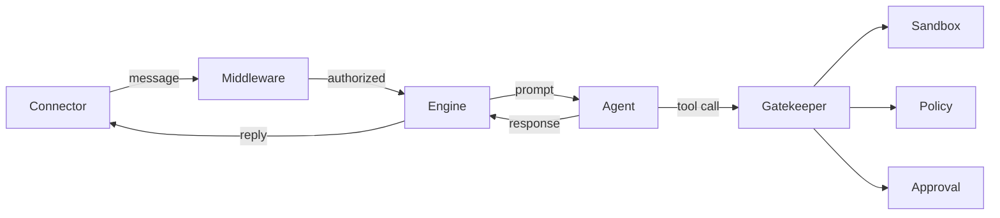

# leashd Documentation

leashd is an open-source remote AI-assisted development framework. It lets developers drive Claude Code agent sessions from any device while enforcing YAML-driven safety policies that gate dangerous AI actions behind human approval. The system is modular, lightweight, and bulletproof.

## Three Guarantees

1. **Safety-first** — Every tool call passes through a three-layer pipeline (sandbox, policy, approval) before execution. Destructive operations require explicit human consent.
2. **Pluggable** — Agents, connectors, middleware, storage backends, and plugins are all protocol-based. Swap or extend any component without touching the core.
3. **Auditable** — Every tool attempt, approval decision, and safety violation is logged to an append-only JSONL audit trail.

## System Overview



## Documentation Map

| Document | Description |
|---|---|
| [CLI Reference](cli.md) | All `leashd` subcommands, daemon lifecycle, config management |
| [Architecture](architecture.md) | Component map, dependency injection, startup/shutdown lifecycle |
| [Safety Pipeline](safety-pipeline.md) | Gatekeeper, sandbox, policy engine, approval coordinator |
| [Engine](engine.md) | Message lifecycle, plan mode, streaming, slash commands |
| [Configuration](configuration.md) | All `LEASHD_` environment variables reference |
| [Policies](policies.md) | YAML policy format, rule matching algorithm, built-in presets |
| [Events](events.md) | EventBus, all event types, payload schemas |
| [Plugins](plugins.md) | Plugin protocol, lifecycle hooks, AuditPlugin example |
| [Agents](agents.md) | BaseAgent protocol, ClaudeCodeAgent, session resume |
| [WebUI](webui.md) | Browser-based interface — setup, WebSocket protocol, authentication |
| [Connectors](connectors.md) | BaseConnector ABC, handler registration, building a connector |
| [Middleware](middleware.md) | MiddlewareChain, auth, rate limiting |
| [Storage](storage.md) | SessionStore protocol, memory and SQLite backends |
| [Browser Testing](browser-testing.md) | Playwright MCP setup, browser tool policies, test agents |
| [Interactions](interactions.md) | Question flow, plan review flow, asyncio bridge |
| [Testing Setup](testing-setup.md) | Three-tier setup guide for e2e testing with /test and Playwright |
| [Autonomous Mode](autonomous-mode.md) | AI approval, AI plan review, test-and-retry loop, task orchestrator, autonomous policy |
| [Autonomous Setup Guide](autonomous-setup-guide.md) | Step-by-step guide to configure a fully autonomous coding agent |

## Quick Start

```bash
# Install
pip install leashd        # or: uv tool install leashd
# or from source:
git clone <repo-url> && cd leashd && uv sync

# First-time setup wizard
leashd init

# Start the daemon
leashd start

# Check status
leashd status
```

The setup wizard prompts for your approved directory and optional Telegram credentials. No manual config file editing needed.

See [CLI Reference](cli.md) for all commands, and [Configuration](configuration.md) for the full environment variable reference.
