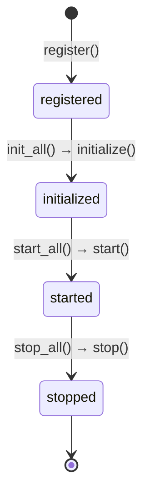
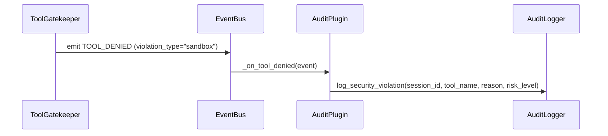
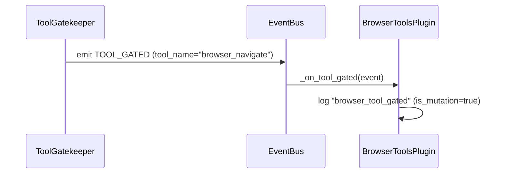
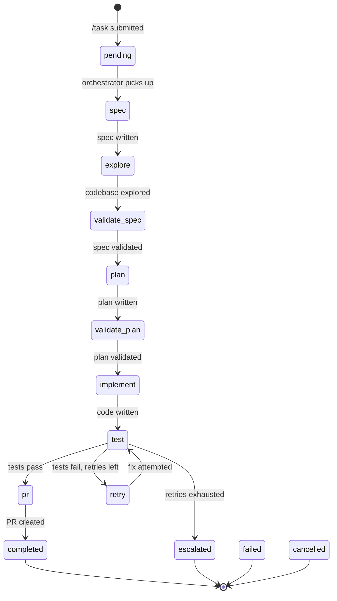

# Plugin System

Plugins extend leashd with observability, custom logic, and integration hooks. They subscribe to `EventBus` events and react without modifying core components.

## Two Plugin Systems

leashd has two distinct plugin systems:

- **leashd plugins** — EventBus subscribers managed via `PluginRegistry`. They hook into leashd's internal event lifecycle (tool gating, message routing, test workflows, etc.). This is what this document covers.
- **Claude Code plugins** — SDK-level extension packages with `.claude-plugin/plugin.json` manifests. They provide skills, agents, hooks, MCP servers, and LSP servers to the Claude Agent SDK. Managed via the `leashd plugin` CLI and `/plugin` chat command. See [CLI Reference — Plugin Management](cli.md#plugin-management) for details.

## Plugin Protocol

```python
class LeashdPlugin(Protocol):
    meta: PluginMeta

    async def initialize(self, context: PluginContext) -> None: ...
    async def start(self) -> None: ...
    async def stop(self) -> None: ...
```

### `PluginMeta`

```python
class PluginMeta(BaseModel):
    model_config = ConfigDict(frozen=True)

    name: str
    version: str
    description: str = ""
```

### `PluginContext`

```python
class PluginContext(BaseModel):
    model_config = ConfigDict(frozen=True, arbitrary_types_allowed=True)

    event_bus: EventBus
    config: LeashdConfig
```

Plugins receive a `PluginContext` during initialization. This gives them access to the event bus for subscribing to events and the configuration for reading settings.

## Lifecycle



| Phase | Method | When | Purpose |
|---|---|---|---|
| Register | — | `build_engine()` | Plugin added to `PluginRegistry` |
| Initialize | `initialize(context)` | `Engine.startup()` → `PluginRegistry.init_all()` | Subscribe to events, set up resources |
| Start | `start()` | After all plugins are initialized | Begin background tasks |
| Stop | `stop()` | `Engine.shutdown()` → `PluginRegistry.stop_all()` | Clean up resources |

Plugins are stopped in **LIFO order** (last registered, first stopped) to respect dependency ordering.

## Plugin Registry

`PluginRegistry` (`plugins/registry.py`) manages the plugin collection:

| Method | Description |
|---|---|
| `register(plugin)` | Add a plugin. Raises `PluginError` if name already registered. |
| `get(name)` | Retrieve a plugin by name. Returns `None` if not found. |
| `plugins` | Property returning the list of all registered plugins. |
| `init_all(context)` | Call `initialize()` on each plugin in registration order. |
| `start_all()` | Call `start()` on each plugin. |
| `stop_all()` | Call `stop()` on each plugin in reverse order. |

## Built-In: `AuditPlugin`

`AuditPlugin` (`plugins/builtin/audit_plugin.py`) logs sandbox violations from `TOOL_DENIED` events to the audit trail.



### Implementation

```python
class AuditPlugin:
    meta = PluginMeta(
        name="audit",
        version="0.1.0",
        description="Logs sandbox violations from TOOL_DENIED events",
    )

    def __init__(self, audit_logger: AuditLogger) -> None:
        self._audit = audit_logger

    async def initialize(self, context: PluginContext) -> None:
        context.event_bus.subscribe(TOOL_DENIED, self._on_tool_denied)

    async def start(self) -> None:
        pass  # No background tasks

    async def stop(self) -> None:
        pass  # No cleanup needed

    async def _on_tool_denied(self, event: Event) -> None:
        if event.data.get("violation_type") == "sandbox":
            self._audit.log_security_violation(
                session_id=event.data["session_id"],
                tool_name=event.data["tool_name"],
                reason=event.data["reason"],
                risk_level="high",
            )
```

The plugin only reacts to sandbox violations (not policy denials) to avoid duplicating audit entries that the gatekeeper already logs directly.

## Built-In: `BrowserToolsPlugin`

`BrowserToolsPlugin` (`plugins/builtin/browser_tools.py`) provides observability for the 28 Playwright MCP browser tools. It logs when browser tools enter the safety pipeline, are allowed, or are denied.



### Events

| Event | Handler | Logged when |
|---|---|---|
| `TOOL_GATED` | `_on_tool_gated` | A browser tool call enters the safety pipeline |
| `TOOL_ALLOWED` | `_on_tool_allowed` | A browser tool call is approved |
| `TOOL_DENIED` | `_on_tool_denied` | A browser tool call is denied (logged at warning level) |

Each log entry includes the `tool_name`, `session_id`, and (for gated events) an `is_mutation` flag indicating whether the tool modifies the browser state.

### Exported Constants

The module exports constants for classifying browser tools in other components:

| Export | Type | Description |
|---|---|---|
| `BROWSER_READONLY_TOOLS` | `frozenset[str]` | 7 tools that observe without changing the page |
| `BROWSER_MUTATION_TOOLS` | `frozenset[str]` | 21 tools that interact with or modify the page |
| `ALL_BROWSER_TOOLS` | `frozenset[str]` | Union of readonly and mutation sets (28 total) |
| `is_browser_tool(name)` | `function` | Returns `True` if the tool name is a Playwright browser tool |

See [Browser Testing](browser-testing.md) for the full browser testing guide.

## Built-In: `WebAgentPlugin`

`WebAgentPlugin` (`plugins/builtin/web_agent.py`) handles the `/web` command for autonomous web automation with content-level human approval.

| Aspect | Detail |
|---|---|
| Subscribes to | `COMMAND_WEB`, `CONFIG_RELOADED` |
| Emits | `WEB_STARTED` |
| Auto-approves | All 28 browser tools, agent-browser commands, Write, Edit, Skill |

The plugin parses `/web` command arguments (recipe name, `--topic`, `--url`, `--fresh`, `--resume`), loads the matching playbook, builds the system prompt, and activates web mode on the session.

### Recipes and Playbooks

Built-in recipe: `linkedin_comment` — searches LinkedIn for posts on a topic, presents candidates to the user, drafts a comment with human approval, and posts it.

Playbooks (YAML files in `plugins/builtin/playbooks/`) define step-by-step navigation guides with phases, steps, tool hints, verification flags, and backend-specific overrides.

The `linkedin_comment` playbook includes a **comment verification pipeline** to prevent duplicated text:
- `type` step: clears editor (Select All + Delete) before typing the full comment in a single call
- `verify_draft` step: takes a snapshot to confirm typed text matches the approved draft
- `submit` step: clicks Post only after verification passes

### Session Checkpoint

The web agent writes two persistence files during a session:

| File | Format | Purpose |
|---|---|---|
| `.leashd/web-checkpoint.json` | JSON | Structured state — posts scanned, comments drafted/posted, phase tracking, timestamps |
| `.leashd/web-session.md` | Markdown | Human-readable summary |

On `--resume`, the checkpoint JSON is loaded and injected into the prompt as `PREVIOUS WEB SESSION STATE`. Falls back to legacy markdown if JSON is missing. The checkpoint models are defined in `web_checkpoint.py`:

- `WebCheckpoint` — top-level model with session ID, platform, auth, phase, posts, comments, errors
- `ScannedPost` — index, author, snippet, URL
- `DraftedComment` — target post, draft text, status (drafted/approved/rejected/posted)
- `PostedComment` — target post, comment text, timestamp

Persistence uses atomic writes (temp file + rename) matching the `config_store.py` pattern.

## Built-In: `TestRunnerPlugin`

`TestRunnerPlugin` (`plugins/builtin/test_runner.py`) activates the 9-phase test workflow via the `/test` command.

| Aspect | Detail |
|---|---|
| Subscribes to | `COMMAND_TEST` |
| Emits | `TEST_STARTED` |
| Auto-approves | All 28 browser tools, test bash commands (`pytest`, `jest`, `vitest`, etc.), Write/Edit for test files |

The plugin intercepts `/test` commands with structured flags (`--url`, `--framework`, `--dir`, `--no-e2e`, `--no-unit`, `--no-backend`), sets the session to test mode, and instructs the agent to run a multi-phase test workflow including discovery, generation, execution, and healing.

## Built-In: `MergeResolverPlugin`

`MergeResolverPlugin` (`plugins/builtin/merge_resolver.py`) handles `/git merge` conflict resolution.

| Aspect | Detail |
|---|---|
| Subscribes to | `COMMAND_MERGE` |
| Emits | `MERGE_STARTED` |
| Auto-approves | Edit, Write, Read, and git read commands |

When a merge results in conflicts, the plugin sets the session to merge mode and instructs the agent to resolve conflicts file by file, then presents auto-resolve/abort buttons to the user.

## Built-In: `TestConfigLoaderPlugin`

`TestConfigLoaderPlugin` (`plugins/builtin/test_config_loader.py`) loads per-project test configuration from `.leashd/test.yaml`.

| Aspect | Detail |
|---|---|
| Config file | `.leashd/test.yaml` in the project working directory |
| Merge behavior | CLI flags override config file values |
| Supported fields | URL, server command, framework, credentials, preconditions |

The plugin provides project-specific defaults for the `/test` workflow, so teams can commit shared test configuration without passing flags every time.

## Built-In: `TaskOrchestrator`

`TaskOrchestrator` (`plugins/builtin/task_orchestrator.py`) drives autonomous tasks through a multi-phase workflow: spec → explore → validate → plan → implement → test → PR. It provides crash recovery, SQLite persistence, per-chat concurrency control, and cost tracking.



| Aspect | Detail |
|---|---|
| Subscribes to | `TASK_SUBMITTED`, `SESSION_COMPLETED`, `MESSAGE_IN` |
| Emits | `TASK_PHASE_CHANGED`, `TASK_COMPLETED`, `TASK_FAILED`, `TASK_ESCALATED`, `TASK_CANCELLED`, `TASK_RESUMED` |
| Auto-approves | Write, Edit, NotebookEdit during `auto` mode phases |
| Config | `LEASHD_TASK_ORCHESTRATOR` (enable), `LEASHD_TASK_MAX_RETRIES`, `LEASHD_TASK_PHASE_TIMEOUT_SECONDS` |

The orchestrator uses `KeyedAsyncQueue` (`core/queue.py`) for per-chat serialization — tasks for the same chat execute sequentially, while different chats run concurrently. Task state is persisted to SQLite via `TaskStore` (`core/task.py`), enabling crash recovery on daemon restart. On startup, `start()` loads all non-terminal tasks and resumes them from their current phase.

See [Autonomous Mode](autonomous-mode.md#task-orchestrator) for the full state machine, phase walkthrough, and configuration details.

## Writing a Custom Plugin

### Step 1: Define the Plugin

```python
from leashd.plugins.base import PluginContext, PluginMeta, LeashdPlugin
from leashd.core.events import MESSAGE_IN, Event


class MetricsPlugin:
    meta = PluginMeta(
        name="metrics",
        version="0.1.0",
        description="Tracks message counts per user",
    )

    def __init__(self) -> None:
        self._counts: dict[str, int] = {}

    async def initialize(self, context: PluginContext) -> None:
        context.event_bus.subscribe(MESSAGE_IN, self._on_message)

    async def start(self) -> None:
        pass

    async def stop(self) -> None:
        # Flush metrics, close connections, etc.
        pass

    async def _on_message(self, event: Event) -> None:
        user_id = event.data["user_id"]
        self._counts[user_id] = self._counts.get(user_id, 0) + 1
```

### Step 2: Register via `build_engine()`

```python
from leashd.app import build_engine

engine = build_engine(plugins=[MetricsPlugin()])
```

The `AuditPlugin` is always registered automatically. User-provided plugins are registered after it.
